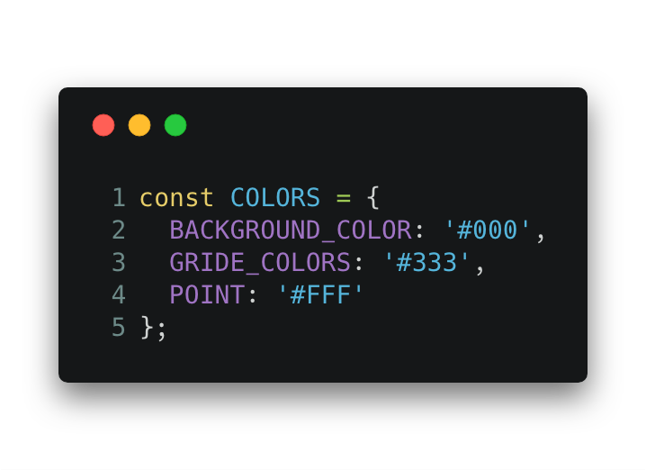
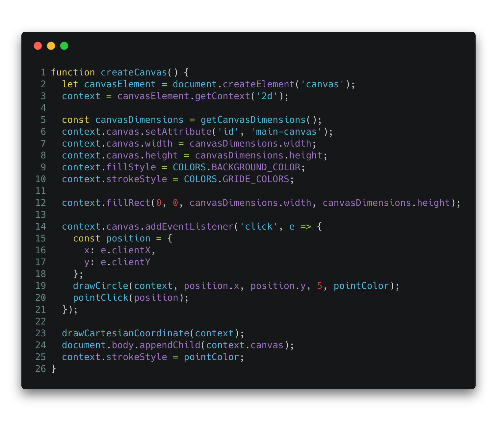
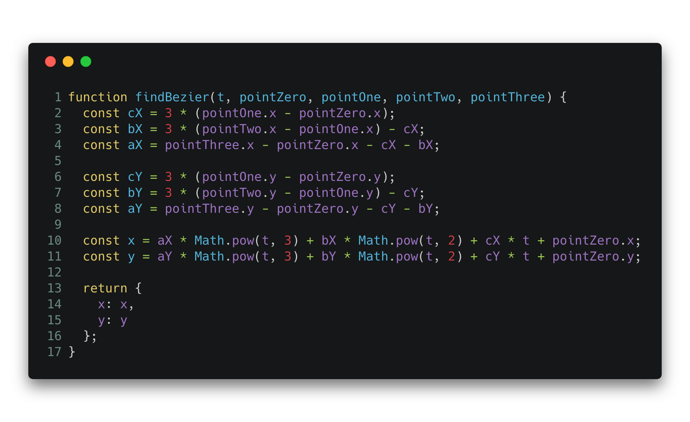
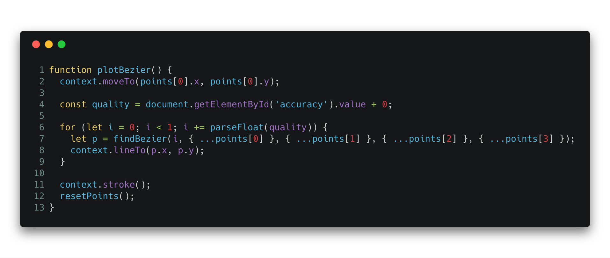
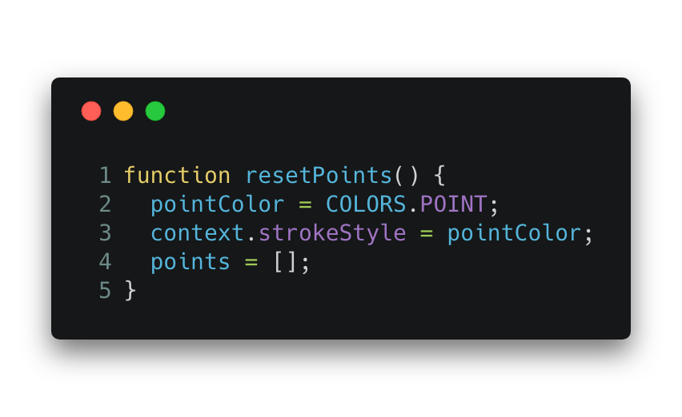

# Trabalho de Computação Gráfica

Este trabalho da matéria de Computação Gráfica tem como objetivo implementar a curva de Bezier utilizando 4 pontos.

## Aluno
```js
const nome = 'Rafael Câmara Magalhaes';
const matrícula = 513041;
```
## Stack
Para a construção do trabalho foi utilizado:
* JavaScript;
* CanvasJS;
* CSS;

## Vídeo demonstrativo
Para ter um preview do comportamento do sistema desenvolvido, acesse o link a seguir para o vídeo no Youtube.

https://www.youtube.com/watch?v=L46CyhRlFH4

## Código fonte

O código deste projeto poderá ser encontrado no github: https://github.com/rafaelcamaram/canvas-bezier

## Manual do usuário

### Passos necessários para rodar o sistema

Não é necessário fazer nenhum tipo de configuração/compilação do sistema antes de rodar o mesmo. Basta possuir um browser habilitado para a execução de JavaScript e abrir o arquivo `index.html`.

1. Abrir a pasta do projeto;
2. Abrir o arquivo `index.html` em um navegador de sua preferência;
3. Selecione 4 (quatro) pontos quaisquer na tela. Estes pontos serão utilizados para cálcular qual curva será gerada. 
    
    3.1 Vale lembrar que você pode repetir esse processo quantas vezes desejar
4. Foi adicionado também um controlador de acurácia no centro superior da tela. Através dele você poderá definir a qualidade das curvas que serão geradas.

## Principais funções

### constant.COLORS
Antes de qualquer coisa, nós criamos uma constante que foi utilizada durante o código para manter a padronização de cores utilizada na aplicação.




### createCanvas()

Este método é destinado a criar a canvas através da biblioteca que foi utilizada. Este canvas é o responsável por "abrigar" e nos possibilitar que os pontos/retas/demais elementos sejam representados na tela.

Como podemos reparar, nós definimos as dimensões (width e height) do canvas através da função `getCanvasDimensions()` que utiliza a `window` e `document` para obter as dimensões da janela do browser e definir o canvas como `100%` deste valor; tendo uma impressão de *fullscreen*.

Nós criamos também um *listener* de clique no *canvas* que é o responsável por renderizar os pontos aonde o usuário clicar em nosso `context` (*canvas*).


## findBezier() e plotBezier()

Estas duas funções são as funções responsáveis por desenhar/plotar as curvas de Bezier em nosso *canvas*.



## resetPoints()

Método responsável por reiniciar todo o processo. Limpando todas as variáveis auxiliares; iniciando um novo caso de teste.

